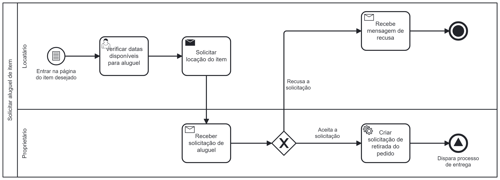
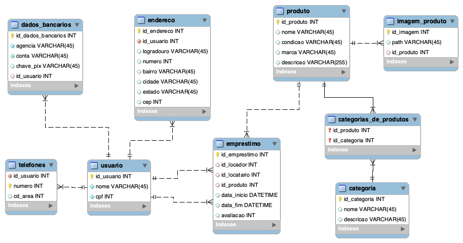

# TOOLBOX

**Davi Goncalves Brandao**

**Kelly Cristina Emidio Mendes**

**Milena Lara Reis Ferreira**

**Ramon Mendes Peixoto**

**Rodrigo Mendes Peixoto**

---

Professores:

**Hugo Bastos de Paula**

**Thiago Augusto Nicolini Silva**

---

_Curso de Engenharia de Software, Unidade Praça da Liberdade_

_Instituto de Informática e Ciências Exatas – Pontifícia Universidade de Minas Gerais (PUC MINAS), Belo Horizonte – MG – Brasil_

## 1. Introdução

O aluguel de objetos tem se consolidado como uma alternativa viável para quem precisa utilizar itens por um curto período de tempo, sem precisar investir na sua aquisição. Nesse contexto, os sites de aluguel de objetos têm ganhado espaço como uma opção conveniente e acessível para os usuários. Segundo a consultoria americana Grand View Research, o mercado global de aluguel de objetos deve crescer a uma taxa anual composta de 7,9% entre 2019 e 2025, impulsionado pela popularização dos sites de aluguel. 

No Brasil, essa tendência também tem se fortalecido, conforme aponta um estudo da plataforma de comércio eletrônico OLX. As buscas por aluguel de objetos na plataforma cresceram em 70% durante o ano de 2020. Ainda, a economia compartilhada tem sido vista como uma forma mais sustentável de consumo, uma vez que a reutilização de objetos reduz a necessidade de novas produções e diminui a quantidade de resíduos gerados. 

Um estudo publicado na Revista Interdisciplinar de Marketing (RIM), da Universidade Federal de Pernambuco (UFPE), destaca que o uso compartilhado de objetos pode ser uma forma de promover o consumo consciente. Além disso, a sustentabilidade é uma preocupação crescente entre os consumidores, e o aluguel de objetos pode ser visto como uma opção de consumo mais responsável. Um estudo do Instituto de Pesquisa Ambiental da Suécia mostra que o aluguel de roupas pode reduzir significativamente a pegada de carbono da indústria têxtil. 

Entretanto, o mercado de aluguel de objetos enfrenta desafios, como a garantia da segurança dos objetos alugados e a satisfação dos usuários. Segundo um estudo publicado na Revista Brasileira de Marketing (REMKT), da Universidade Presbiteriana Mackenzie, é preciso garantir a qualidade dos objetos alugados e a confiança dos usuários. A falta de confiança na qualidade dos objetos alugados é apontada como uma das principais barreiras para a adoção desse modelo de negócio, conforme um estudo da consultoria americana Accenture. 

Apesar dos desafios, a tendência é que o mercado de aluguel de objetos continue a crescer e se consolidar como uma opção cada vez mais relevante para os consumidores, impulsionado pela busca por um consumo mais consciente e responsável. 

    1.1 Contextualização

Dentro dessa perspectiva, o presente trabalho tem como objetivo apresentar um site de aluguel de objetos que visa conectar proprietários de objetos ociosos com pessoas que precisam utilizá-los por um período limitado. A plataforma oferece uma ampla variedade de objetos, desde utensílios domésticos até equipamentos para construção civil, possibilitando que os usuários encontrem as ferramentas necessárias para suas atividades cotidianas com facilidade e praticidade.

    1.2 Problema

Devido ao alto poder de compra da população, o acúmulo de itens se tornou algo comum na sociedade, ocupando espaço em nossas casas ou parado nas nossas garagens. Uma pesquisa realizada pela nossa equipe aponta que 63,5% das pessoas entrevistadas possuem itens com pouca utilidade ocupando espaço em suas residências, dentre esses 75% cogitam a ideia de alocar esses itens para pessoas desconhecidas na internet, porém não conhecem uma plataforma para intermediar esse contato.

    1.3 Objetivo geral

O projeto tem como objetivo elaborar uma solução com modelo C2C(Consumer to Consumer) através de uma plataforma virtual de locação temporária de itens e bens duráveis.

        1.3.1 Objetivos específicos

- Determinar a abrangência e a viabildiade para o projeto, visando publico alvo, itens de desejo dos consumidores e existência de demanda para a solução proposta.
- Explorar e verificar a aplicabilidade de possíveis meios de obter segurança pessoal e juridica durante o uso da plataforma.
- Consolidar alternativa de negociação online de itens seminovos e usados com flexibilidade e garantias.
- Buscar alternativas logísticas de manutenção da disponibilidade e da mobilidade dos itens a serem negociados.

    1.4 Justificativas

Alugar um item traz diversas vantagens e uma das principais é reduzir os custos e o gasto extra de insumos de produção em casos de necessidade pontual de alguem produto por um curto período.
Desse modo, foi pensado desenvolver uma plataforma de aluguel entre usuários comuns, onde os mesmos terão a opção de alugar suas próprias ferramentas ou dispo-las a locação. Assim, ambos podem utilizar-se da solução sem a necessidade de deslocamento. Realizando, assim, de forma prática, rápida e assegurada por intermédio de um contrato. Com isto, o locador poderá dispor de renda extra e o locatário de uma economia com eventos pontuais ao utilizarem os serviços da plataforma.

## 2. Participantes do processo

A princípio, estabeleceu-se que a aplicação terá três participantes principais. Para entender melhor esses perfis, elaboramos uma pesquisa em forma de questionário que foi enviada para diversas pessoas. A pesquisa estará detalhada na sessão seguinte deste relatório. A partir dela, detalhamos os seguintes usuários:

- Cliente que vai alugar itens:
    - Pessoas com escolaridade a partir do Ensino Médio completo
    - Público tem um perfil mais jovem, mas abrangendo pessoas até 50 anos.
    - O objetivo desses usuários é disponibilizar itens pessoais com pouco uso para aluguel, podendo lhes gerar uma renda extra.
    - Necessitam da garantia que os objetos serão devolvidos em estado íntegro ou que haverá algum tipo de compensação financeira em casos de avarias, extravios ou devolução fora do prazo estabelecido.
    - Necessitam de facilidade para envio e retorno dos produtos.
- Cliente que vai disponibilizar itens para aluguel:
    - Perfil de escolaridade, gênero e faixa etária similar ao dos clientes que vão disponibilizar itens para aluguel.
    - O objetivo desses usuários é alugar itens dos quais fazem uso tão pontual que não valeria a pena comprar, conseguindo assim uma economia em gastos.
    - A maioria dos itens que desejam alugar caem em duas categorias:
        1 - Itens voltados para eventos e ocasiões especiais: equipamentos de som e luz, cadeiras, roupas especiais para festas, mesas de jogos, etc
        2 - Itens de manutenção e construção: ferramentas, equipamentos de limpeza, equipamentos de construção civil, etc.
    - Necessitam de produtos com padrões de qualidade, que sejam entregues em situação íntegra.
    - Necessitam de receber os produtos e retorná-los.
- Empresa de transporte parceira:
    - Necessitam de integração com a então plataforma para obtenção de informações necessárias
    - Objetivam prestar serviço remunerado de logistica de entrega
    - Necessitam obter informações dos clientes nas duas extremidades
    - Necessitam de mecanismos de confirmação de identidade e de entrega, assim como o rastreio da encomenda
    

### Pesquisa
Para elaborar o perfil dos nossos usuários, nos embasamos nos resultado de um formulário com questões abertas e fechadas que contemplam tanto a possibilidade pegar itens alugados como de colocar itens para aluguel. O questionário teve 52 respostas. Os resultados são apresentados apresentado a seguir:

### Idade
- 36,5% têm entre 18 e 25 anos
- 11,5% têm entre 26 e 30 anos
- 21,2% têm entre 31 e 40 anos
- 23,1% têm entre 41 e 50 anos
- 7,7% têm entre 51 e 60 anos

Temos um público com faixa etária bem variada e não tivemos participantes acima de 60 anos. Predominou-se na pesquisa o público mais jovem, com até 25 anos.

### Escolaridade
- 1,9% têm Ensino Fundamental completo
- 32,7% têm Ensino Médio completo
- 28,8% têm Ensino Supeior incompleto
- 25% têm Ensino Superior completo
- 3,8% têm Mestrado
- 7,7% têm Doutorado

A maioria dos participantes têm ensino médio completo, havendo também uma grande parcela de pessoas com ensino superior completo ou em curso.

### Perguntas sobre o produto
- 63,5% das pessoas alegam ter produtos sem uso, e 15,4% alegam talvez ter.
- 50% alugaria estes itens para pessoas desconhecidas por meio de uma plataforma intermediadora, e 25% talvez alugariam, o que totaliza 75% dos entrevistados que poderiam ser potenciais clientes.
- 88,5% cogitam alugar itens de uma pessoa desconhecida por meio de uma plataforma intermediadora.

### O que a plataforma precisa oferecer
Perguntamos aos participantes o que a plataforma precisaria oferecer para que eles colocassem seus itens para aluguel através dela. Entre as respostas, temos:
- Segurança
- Garantia de devolução em bom estado
- Reembolso em caso de avarias
- Seguro para cobrir perdas, roubo, extravio e mau uso
- Clareza nos termos do serviço
- Bom suporte ao cliente
- Serviço de delivery
- Formas de verificar a idoneidade dos locatários

### Itens que colocariam para alugar
Indicamos aos participantes categorias de itens que poderiam ser colocados para aluguel na plataforma e pedimos que selecionassem os itens que estivessem dispostos a alugar. Deixamos também um campo "outros" para itens que não havíamos contemplado.
- Livros: 55,8%
- Ferramentas: 46,2%
- Video game: 32,7%
- Eletrodoméstico (ex: freezer, aspirador de pó, lava-louças): 32,7%
- Caixa de som: 26,9%
- Móveis: 23,1%
- Mesa de bilhar, ping-pong, totó, etc: 23,1%
- Equipamento de iluminação: 21,2%
- Churrasqueira: 19,2%
- Outros (equipamentos de ginástica, roupas, etc): 7,6%

### Itens que alugariam
Pedimos aos participantes que indicassem itens de uso eventual que gostariam de alugar e alguns dos itens mencionados são:
- Bicicleta, patins
- Cadeiras
- Mesas de jogos
- Churrasqueira
- Mala
- Bolsa
- Jóias
- Roupas para ocasiões específicas
- Ferramentas de construção civil
- Misturador de cimento
- Parafusadora
- Escada
- Aspirador de pó
- Limpador de estofado
- Máquina de lavar piso
- Laptop / computador
- Video game
- Carros

## 3. Modelagem do processo de negócio

## 3.1. Análise da situação atual

Como plataformas de venda
A OLX é líder de mercado de compras e vendas online, e a maior representante da economia circular no Brasil. O modelo de negócio da OLX é do tipo plataforma multilateral e funciona ao conectar vendedores e compradores de produtos novos e usados para fazerem negócios entre si. A OLX apostou em baixar as barreiras para compra e venda de itens usados ao permitir anúncios gratuitos e grande facilidade de cadastro e postagem de fotos dos itens, bem como comunicação via chat entre comprador e vendedor, tudo isso via um aplicativo mobile muito fácil de usar. Apesar de ser uma plataforma de vendas, um número significativo dos anúncios da Olx são compostos por anúncios de alocação, seja ele de imóveis, casas, ou até equipamentos. Por ser uma plataforma de vendas a Olx não proporciona o devido suporte a alocação de equipamentos, apenas atuando de forma que interliga vendedor com o comprador ou locador, por meio de anúncio e um chat para comunicação entre os mesmos.

O Mercado Livre é um marketplace online que conecta compradores e vendedores de diversos produtos e serviços. O sistema funciona como uma plataforma de comércio eletrônico que oferece uma série de recursos e ferramentas para facilitar a compra e venda de produtos.
Os vendedores podem cadastrar seus produtos no Mercado Livre, definindo o preço, as condições de pagamento e envio, além de incluir informações detalhadas sobre o produto. Os compradores podem então acessar o site e buscar pelos produtos de seu interesse, usando filtros e outras ferramentas de busca para encontrar exatamente o que precisam.
Uma vez que o comprador escolhe um produto e faz a compra, o Mercado Livre atua como intermediário, garantindo a segurança e a transparência da transação. O pagamento é feito pelo site, que retém o valor até que o comprador receba o produto e confirme que está tudo certo.
O sistema também oferece recursos de avaliação e reputação, permitindo que os compradores e vendedores avaliem uns aos outros e criem um histórico de confiança na plataforma. Além disso, o Mercado Livre conta com um serviço de atendimento ao cliente e resolução de conflitos, garantindo que as transações sejam realizadas da forma mais tranquila possível.

No entanto, no então momento da idealização do projeto, não temos nenhuma plataforma em âmbito nacional que busca a mesma solução que foi proposta pelo projeto, sobretudo ao se dizer sobre consumo compartilhado. Contudo, existiram há alguns anos algumas plataformas que se propunham a realizar tarefas iguais e similares às propostas nesta solução. Para fins de exemplo, temos a plataforma descontinuada "Rent for All", disponibilizada ao publico no ano de 2015 e descontinuada em meados de 2019, a qual disponibilizava itens como mesas, impressoras, geladeiras, instrumentos musicais, objetos de luxo, poltronas etc. para locação C2C, onde era possível cadastrar os produtos e receber solicitações de reservas por email ou SMS, por onde, depois,  eram feitas as negociações. Os locadores e locatários eram avaliados a cada negociação. A plataforma foi descontinuada e não se tem informações publicas que informam a razão do fim das atividades.

Outra plataforma já descontinuada é a "Alooga", que possui fundação um ano após a concorrente citada anteriormente e tinha como diferencial um sistema próprio de garantia, na qual quem disponibilizar um objeto só poderia alugá-lo se tivesse mais de 80% de aceitação nas avaliações dos usuários. O locador também seria avaliado ao fim do processo. Além disso, existiu um modelo de contrato de locação opcional, onde incluia uma garantia que cobriria danos ou extravio de até 1500 reais. 

No exterior, temos plataformas ativas como a plataforma estadunidense chamada "Yoodlize". Esta não possui atuação em todo território estadunidense, porem possui boa gama de adeptos nos locais em que se consolidou. Tendo sido fundada em 2018, possui recente captação de investimentos do investidor Alpine 100 e foca sua atuação em veículos e ferramentas recreacionais ("outdoor") e eletrônicos. Não foram encontradas garantias ao usuário no uso da plataforma.
Em contrapartida, a plataforma britânica "Fat llama" possui alta gama de produtos disponibilizados e boa atuação no território nacional. A plataforma se foca em eletrônicos e possui garantia contra danos e extravios no valor de até 25000 euros por item, possuindo boa recomendação em revistas conceituadas (como a Forbes) e possui principal atuação na locação de gadgets, instrumentos musicais e eletrônicos para eventos.
Nenhuma das plataformas pesquisadas possui integração com a entrega dos itens ao locatário.

Como plataformas similares ativas no território brasileiro destacam-se duas plataformas que atuam alugando equipamentos:  como Rentalfuros e Centralloc, que tem seus objetivos parecidos com o do corrente projeto. A principal diferença é que essas empresas contam com seu próprio estoque para alugar equipamentos.
Os processos consistem em:
O cliente entra em contato com o vendedor (via web ou diretamente na loja) que, por sua vez, confere a disponibilidade do equipamento solicitado. Caso tenha disponibilidade, o vendedor apresenta uma proposta para o cliente e, sendo aprovada, ele retira o equipamento diretamente da loja juntamente com o contrato de locação assinado por ambas as partes. Além desses processos, internamente, essas empresas contam com vistorias para garantir que os itens sejam enviados com qualidade.

## 3.2. Descrição Geral da proposta

Partindo do nosso objetivo geral de construir uma aplicação voltada para o empréstimo de objetos diversos em modelo C2C, segue uma descrição da nossa proposta:
- Aplicação web com design desktop-first;
- Plataforma onde pessoas físicas podem alugar qualquer tipo de item para outras pessoas físicas.
- Existem dois tipos de cadastro:
    - Cadastro do usuário que vai alugar itens
    - Cadastro do usuário que vai colocar itens para aluguel
- As entregas serão realizadas por entregadores de empresas parceiras (Uber, Loggi etc.)
- Os itens disponibilizados para aluguel serão avaliados pelos usuários que os utilizarem após a devolução, utilizando critérios como a compatibilidade com a descrição providenciada no anúncio, se o item serviu bem ao objetivo, etc.
- Os usuários que utilizarem os itens serão avaliados quanto à sua conduta, considerando critérios como se o item foi devolvido em sua integridade, sem avarias e se foi devolvido dentro do prazo.
- A segurança dos itens emprestados será resguardada por meio de apólice de seguro para por (???)

### Limites
Algumas possíveis limitações da nossa solução incluem:
- Itens de baixo valor não seriam viáveis, porque a taxa paga pelo aluguel sairia pelo preço equivalente ao de uma compra
- Logística pode ter alto custo para envio e devolução dos itens locados

## 3.3. Modelagem dos Processos

### 3.3.1 Processo 1 – ANUNCIO DE ITENS

O processo começa com a verificação do login. Depois que o anunciante é validado, ele será direcionado para a página de descrição de itens, onde deverá informar o nome, imagem, categoria e outras informações relevantes. Em seguida, ele irá cadastrar seus dados bancários para o recebimento do pagamento. Uma vez que tudo for validado, ele irá revisar todas as informações e, se estiver tudo correto, poderá publicar o anúncio. 

### 3.3.2 Processo 2 – Devolução do produto

O processo inicia quando se aproxima da data de devolução do produto, o setor de suporte da Toolbox envia um alerta para o cliente abrir a solicitação de devolução. Após a solicitação o setor de suporte avalia os dados do cliente e do produto e abre uma solicitação na trasportadora que, por sua vez valida os dados da entrega e, se aprovado, realiza a entrega. Finalizando com o fechamento da solicitação do cliente.

### 3.3.3 Processo 3 - Solicitar aluguel de item
O processo se inicia com o locatário selecionando o item desejado, o que o direcionado para a página do item. O locatário verifica as datas disponíveis para aluguel e confere as especificações do item. Caso as condições atendam às suas necessidades, ele solicita a locação, e deve então confirmar os dados da entrega (data, endereço, etc). O proprietário confirma ou rejeita o pedido. O usuário recebe a confirmação ou rejeição e em caso de confirmação, o pagamento é efetuado e a transportadora parceira cria um pedido de recolhimento junto ao proprietário e de entrega ao locatário. O locatário acusa recebimento.

### 3.3.4 - Processo 4 - Reportar problema com o item
O processo começa quando o usuário recebe um produto com um defeito. O usuário entra na plataforma do Toolbox e relata o problema com descrição textual e imagens. O Toolbox irá avaliar se o problema descrito pelo usuário se encaixa nos critérios de reembolso. Caso o problema não se encaixe nos parâmetros de reembolso, o usuário receberá uma mensagem com mais informações. 

### 3.3.5 - Processo 5 - Avaliação de produtos
O processo começa no recebimento do produto e na vontade de usuário em reportar uma avaliação ou algum problema com a integridade do produto ou o serviço prestado. Caso haja algum problema, serão solicitadas informações adicionais e avaliada a situação individualmente. Em caso de comprovado o problema, será solicitado reembolso  de acorodo com as regras da plataforma.
Caso este siga para a avaliação, poderá ser feita a avaliação do produto e do proprietário (locador) e terá sua avaliação submetida e registrada.

## 4. Projeto da Solução

### 4.1. Detalhamento das atividades

#### Processo 1 – ANUNCIO DE ITENS

**DESCRIÇÃO DO PRODUTO**

| **Campo** | **Tipo** | **Restrições** | **Valor default** |
| --- | --- | --- | --- |
| Categoria | Caixa de texto/Escolha múltipla | Campo obrigatorio |   |
| Nome do produto | Caixa de Texto | Maximo 60 caracteres |   |
| Marca | Caixa de texto/Escolha múltipla | Campo obrigatorio |   |
| Condição do produto | Escolha múltipla | Campo obrigatorio |   |
| Preço do Aluguel | Numero | R$ 000.000.000,00 |   |
| imagens do produto | imagem | 7MB |   |
| Titulo do Anuncio | Caixa de Texto | Maximo 60 caracteres |   |

#### Processo 2 – Devolução de itens

**Solicita Devolução**

| **Campo** | **Tipo** | **Restrições** | **Valor default** |
| --- | --- | --- | --- |
| Produtos locados | Table | Somente produtos que esse cliente alugou |  |
| Datas disponíveis | Seletor de data | Deve exibir em cinza as datas que superem o dia de devolução | Data programada da devolução |
| Devolução antecipada | Texto |  Somente texto e imagens | vazio |

#### Processo 3 - Solicitar aluguel de item

**Verificar datas disponíveis para aluguel**

| **Campo** | **Tipo** | **Restrições** | **Valor default** |
| --- | --- | --- | --- |
| Datas disponíveis | Seletor de data | Deve exibir em cinza as datas em que o item está alugado | Presente data |

**Solicitar locação do item**
| **Campo** | **Tipo** | **Restrições** | **Valor default** |
| --- | --- | --- | --- |
| Datas do aluguel | Seletor de data | Deve exibir em cinza as datas em que o item está alugado | Presente data |
| Quantidade | Numérico | Limitado à quantidade de itens disponíveis | 1 |

**Receber solicitação de aluguel**

| **Campo** | **Tipo** | **Restrições** | **Valor default** |
| --- | --- | --- | --- |
| Datas do aluguel | Seletor de data | Mostrar datas do item, e destacar caso haja sobreposição com algum pedido anterior de alguel |  |
| Quantidade | Numérico | Limitado à quantidade de itens disponíveis |  |
| Seleção de confirmação | Seletor | Apenas 2 opções (SIM  e NÃO) | Sim |

#### f 4

| **Campo** | **Tipo** | **Restrições** | **Valor default** |
| --- | --- | --- | --- |
| Relatar problema | caixa de texto | máximo 500 caracteres |  |
| Imagem do item  | imagem | 7MB |  |

#### Processo 5 – Avaliação de Itens

**Decisão de avaliação**

| **Campo** | **Tipo** | **Restrições** | **Valor default** |
| --- | --- | --- | --- |
| Deseja Avaliar? | Seleção única |  |  |

**Avaliando produtos/serviço**

| **Campo** | **Tipo** | **Restrições** | **Valor default** |
| --- | --- | --- | --- |
| Nota para o produto | Escolha múltipla | valores de 1 a 5 | 5 |
| Nota para o Serviços | Escolha múltipla | valores de 1 a 5 | 5 |

**Adicionando um elogio**

| **Campo** | **Tipo** | **Restrições** | **Valor default** |
| --- | --- | --- | --- |
| Insira um comentário | Caixa de Texto | Somente texto | vazio |

**Descrevendo um problema**

| **Campo** | **Tipo** | **Restrições** | **Valor default** |
| --- | --- | --- | --- |
| Descreva o problema | Caixa de Texto | Somente texto | vazio |
| Insira uma imagem | Imagem/Arquivo |  | vazio |

### 4.2. Tecnologias

As tecnologias utilizadas para o projeto serão as seguintes:

Camunda: Ferramenta de modelagem de processos que ajuda a visualizar, analisar e otimizar fluxos de trabalho e atividades empresariais. Com o Camunda, podemos criar modelos de processo claros e fáceis de entender, e também automatizar processos empresariais para aumentar a eficiência.

Figma: Ferramenta de design de interface, usada para criar designs e protótipos. Com ele podemos construir um protótipo do site.

Sql management : Ferramenta multifuncional para gerir banco de dados e desenvolvimento.

Bootstrap: Framework utilizado no desenvolvimento front-end de sites e aplicações web. Com ela, podemos criar layouts responsivos e compatíveis com diferentes dispositivos, além de ter acesso a diversos componentes e recursos úteis para o desenvolvimento.

Visual Studio Code: IDE utilizada por desenvolvedores de software. Com ela, podemos escrever e editar código, além de ter acesso a diversos recursos e extensões úteis para o desenvolvimento. Utilizamos para desenvolvimento Front-end.

Visual Studio Community: IDE com ambiente configurado para desenvolvimento em .NET Framework. Utilizamos para desenvolvimento Back-end.

.NET: Framework de desenvolvimento de aplicações web em C++ que simplifica o processo de criação de APIs. Com ele, podemos criar APIs robustas e escaláveis de maneira mais rápida e eficiente.

SQL server: Sistema de gerenciamento de banco de dados relacional utilizado em projetos web. Com ele, podemos armazenar e gerenciar dados de forma eficiente e segura.

HTML, CSS e JavaScript: As três linguagens fundamentais para o desenvolvimento front-end de sites e aplicações web. Com elas, podemos criar páginas web visualmente atraentes e interativas, além de adicionar funcionalidades e interatividade à nossa aplicação.

## 5. Modelo de dados

Apresente o modelo de dados por meio de um modelo relacional ou Diagrama de Entidade-Relacionamento (DER) que contemple todos conceitos e atributos apresentados item anterior. 

## 6. Indicadores de desempenho

| **Indicador** | **Objetivos** | **Descrição** | **Cálculo** | **Fonte dados** | **Perspectiva** |
| --- | --- | --- | --- | --- | --- |
| Tempo medio de locação do mês corrente | Verificar tempo médio de locação de todos os produtos a cada mês | Média aritimética que exprime tempo medio de locação de X itens |  | Tabela empréstimo | Aumento da rentabilidade e Revisão de estratégias |
| Valor médio de rentabilidade mensal de cada item | Verificar tempo médio de locação e o valor total obtido com cada item mensalmente | Média aritimética que excprime tempo medio de locação, junto com a divisão do valor mensal |   | Tabela emprestimo e Tabela produto | Remanejo de exposição dos itens e aumento da rentabilidade |
| Percentual de aumento de produtos anunciados por período | Entender o crescimento da plataforma medindo a quantidade de produtos anunciados e um determinado periodo | Mede a quantidade de produtos anunciados em um periodo e o compara com a quantidade anterior plataforma | | Tabela produto | Aprendizado e crescimento |
| Regiões/municipios com maior crescimento de clientes | Identificar regiões que não utilizam ou utilizam pouco a plataforma | Mede quantidade de clientes por localidade | SOMA DA QUANTIDADE POR RAIO DE X KM  | Tabela endereço | Aprimoramento das medidas de expansão |
| Quantidade de itens por produto/categoria | Identificar a abundancia de intens por categoria/produto | Mede a quantidade de itens com determinadas especificações|  | Tabela produto e Tabela categorias de produtos | Aprimoramento de estrategias |
| Clientes que mais negociam na plataforma | Identificar usuarios que mais negociam na plataforma | Mede quantidade de usuarios que mais negociam, tanto como locatario, tanto como locador | SOMATORIO QUANTIDADE DE LOCAÇÕES POR CLIENTE  |  Tabela usuario e Tabela Emprestimo | Valorização de usuários |

## 7.Sistema desenvolvido

Foi desenvolvido um sistema web de locação de bens pessoais de uso não constante, como ferramentas de construção e reparos, livros, eletronicos e afins. A plataforma consiste em um negócio C2C, onde as negociações de valores, disponibilidade dos itens e tempo de locação são todos definidos pelos usuários, não detendo a Toolbox a posse de nenhum dos itens, onde locatários e locadores
As principais telas que serão encontradas na navegação da plataforma são:

## 8. Conclusão

O trabalho envolveu o desenvolvimento de uma aplicação full stack e foi uma oportunidade de conhecer diversas tecnologias. Escolher as stacks foi desafiador, porque precisávamos conciliar os conhecimentos prévios e disponibilidade de tempo de todas as pessoas envolvidas. A discussão principal ocorreu em torno da escolha da tecnologia de back-end - havia estudantes com conhecimento prévio em stacks diferentes das quais os professores ofereceram suporte e pessoas sem nenhum conhecimento prévio. Tivemos a oportunidade de aplicar na prática conceitos de diversas disciplinas que estudamos neste semestre, e nesse sentido, a proposta da disciplina se concretizou.

Todos os processos propostos foram implementados com sucesso e podemos atribuir este fato à cooperação mútua entre os integrantes, mesmo apresentando dificuldades em integração entre as tecnologias dominadas por cada um. Os processos implementados desempenham funcionalmente suas atribuições e a aplicação funciona como planejada. Contudo, melhorias pontuais podem ser realizdas, visto que as metodologias de desenvolvimento amplamente aceitas nos guiam para uma abordagem incremental iterativa, o que permite ao grupo aprimorar constantemente o projeto à medida que tais ações se mostrarem pertinente com o eventual amadurecimento da plataforma.

Como sugestões para semestre futuros, seria interessante incluir os tutoriais da framework Spring Boot elaborados pelo monitor da disciplina no cronograma. Isso dá um norte para os alunos saberem estipular um ritmo de estudos que seja adequado para a disciplina, visto que um problema que tivemos foi não dar inicio aos tutoriais em tempo hábil para a etapa de desenvolvimento.

Por fim, toda a trajetória se mostrou gratificante ao observarmos os resultados obtidos e o aprendizado que será incorporado para todos os futuros projetos de Trabalhos Interdisciplinares previstos na grade curricular do curso de Engenharia de Software.

# APÊNDICES

**Colocar link:**

Do código (armazenado no repositório): https://github.com/ICEI-PUC-Minas-PPLES-TI/plf-es-2023-1-ti2-0940100-toolbox/tree/master/src

Dos artefatos (armazenado do repositório): https://github.com/ICEI-PUC-Minas-PPLES-TI/plf-es-2023-1-ti2-0940100-toolbox/tree/master/assets/processos

Da apresentação final: https://github.com/ICEI-PUC-Minas-PPLES-TI/plf-es-2023-1-ti2-0940100-toolbox/blob/master/docs/TOOLBOX%20-%20Apresenta%C3%A7%C3%A3o%20Final.pdf;

Do vídeo de apresentação: https://github.com/ICEI-PUC-Minas-PPLES-TI/plf-es-2023-1-ti2-0940100-toolbox/blob/master/assets/video_apresentacao_final.avi

